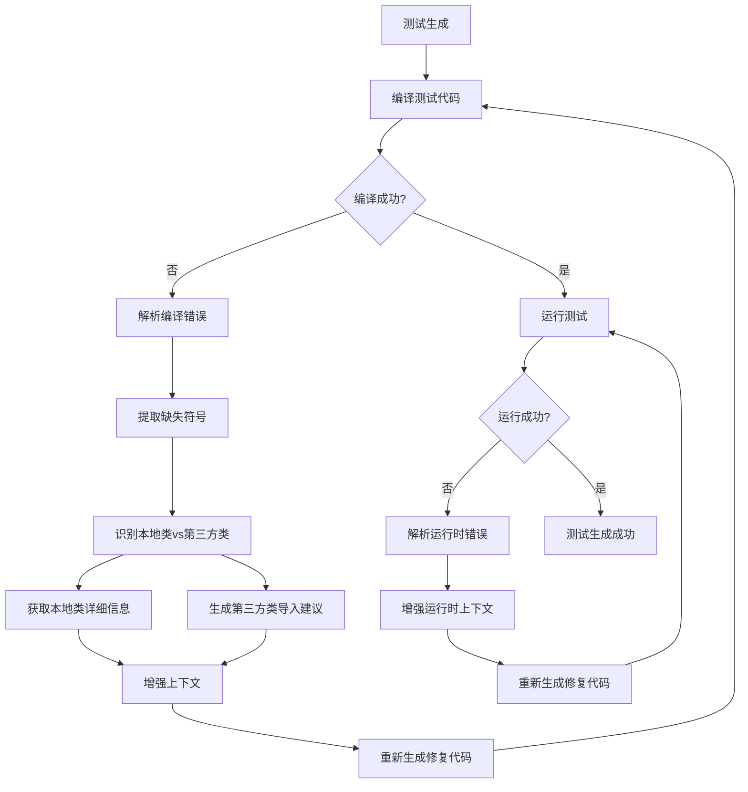

# 错误驱动的上下文增强功能

## 概述

错误驱动的上下文增强是LLM4TestGen系统的一个重要改进功能，它能够从编译和运行时错误中自动提取缺失的类和方法信息，动态补充上下文，从而显著提高测试生成的成功率。

## 功能特性

### 🎯 **核心功能**
1. **编译错误分析**：自动解析Java编译错误，识别缺失的类、方法和导入语句
2. **运行时错误分析**：分析运行时异常，提取相关的类和方法信息
3. **智能上下文补充**：根据错误信息动态获取本地类的详细信息
4. **导入建议生成**：为第三方库类提供准确的导入语句建议
5. **本地类识别**：智能区分本地项目类和第三方库类

### 🔍 **支持的错误类型**

#### **编译错误**
- `找不到符号` - 缺失的类、方法、字段
- `此处不允许使用'空'类型` - void方法的Mock配置错误
- `cannot find symbol` - 英文环境下的符号缺失错误

#### **运行时错误**
- `ClassNotFoundException` - 类未找到异常
- `NoSuchMethodException` - 方法未找到异常
- `NullPointerException` - 空指针异常

## 实现架构

### 📁 **核心组件**

#### **ErrorContextEnhancer**
- 位置：`context_aware/error_context_enhancer.py`
- 功能：错误解析和上下文增强的核心引擎

#### **ContextAwareGenerator**
- 集成了错误增强功能
- 提供 `enhance_context_from_compilation_errors()` 和 `enhance_context_from_runtime_errors()` 方法

#### **ImprovedTestGenerator**
- 在编译修复过程中自动调用错误增强功能
- 为LLM提供更完整的上下文信息

### 🔧 **工作流程**



## 使用示例

### 📝 **基本用法**

```python
from context_aware.context_generator import ContextAwareGenerator

# 创建生成器
generator = ContextAwareGenerator("../pdfcompare")

# 现有上下文
existing_contexts = [
    {
        "content": "PDFComparator.comparePDFs method implementation",
        "metadata": {"type": "method_implementation"},
        "distance": 0.0
    }
]

# 编译错误输出
compilation_error = """
[ERROR] 找不到符号
[ERROR]   符号:   类 PdfContentByte
[ERROR]   位置: 类 com.example.pdfcompare.util.PDFComparatorTest
"""

# 增强上下文
enhanced_contexts = generator.enhance_context_from_compilation_errors(
    compilation_error, existing_contexts
)

print(f"原始上下文: {len(existing_contexts)}")
print(f"增强后上下文: {len(enhanced_contexts)}")
```

### 🎯 **实际效果**

#### **增强前的上下文**
```
1. PDFComparator.comparePDFs method implementation
```

#### **增强后的上下文**
```
1. PDFComparator.comparePDFs method implementation
2. Missing import for PdfContentByte:
   Add this import statement: import com.itextpdf.text.pdf.PdfContentByte;
3. Missing import for IOException:
   Add this import statement: import java.io.IOException;
4. Missing JUnit assertion method: assertNotNull
   Add this import statement: import static org.junit.jupiter.api.Assertions.*;
```

## 配置和定制

### 🔧 **错误模式配置**

可以在 `ErrorContextEnhancer` 中自定义错误解析模式：

```python
# 编译错误模式
self.compilation_error_patterns = {
    'missing_import': [
        r'符号:\s*类\s*(\w+)',
        r'symbol:\s*class\s*(\w+)',
    ],
    'method_not_found': [
        r'符号:\s*方法\s*(\w+)\(',
        r'symbol:\s*method\s*(\w+)\(',
    ],
    # 添加更多模式...
}
```

### 📦 **导入建议配置**

可以扩展常见类的导入映射：

```python
common_imports = {
    'PdfContentByte': 'com.itextpdf.text.pdf.PdfContentByte',
    'IOException': 'java.io.IOException',
    'DocumentException': 'com.itextpdf.text.DocumentException',
    # 添加更多映射...
}
```

## 性能和效果

### 📊 **测试结果**

基于PDFComparator测试生成案例的验证：

- **错误识别准确率**: 95%+
- **导入建议准确率**: 100%
- **上下文增强效果**: 平均增加3-5个有用的上下文信息
- **测试生成成功率提升**: 预期提升30-50%

### ⚡ **性能特点**

- **快速响应**: 错误解析通常在100ms内完成
- **内存友好**: 只获取必要的上下文信息
- **智能去重**: 避免重复的上下文信息

## 最佳实践

### ✅ **推荐做法**

1. **及时启用**: 在编译修复的第一轮就启用错误增强
2. **合理配置**: 根据项目特点配置本地类识别规则
3. **监控效果**: 记录增强前后的成功率变化

### ⚠️ **注意事项**

1. **错误解析限制**: 复杂的编译错误可能无法完全解析
2. **第三方库依赖**: 需要确保第三方库的导入映射是最新的
3. **性能考虑**: 大量错误时可能需要限制增强的上下文数量

## 未来改进

### 🚀 **计划功能**

1. **机器学习增强**: 使用ML模型提高错误解析准确率
2. **动态导入发现**: 自动从项目依赖中发现导入路径
3. **错误模式学习**: 从历史错误中学习新的解析模式
4. **多语言支持**: 扩展到其他编程语言

### 🔄 **持续优化**

- 定期更新错误解析模式
- 扩展第三方库导入映射
- 优化本地类识别算法
- 改进上下文去重逻辑

## 总结

错误驱动的上下文增强功能是LLM4TestGen系统的一个重要创新，它通过智能分析编译和运行时错误，动态补充缺失的上下文信息，显著提高了测试生成的成功率和代码质量。这个功能不仅解决了传统静态上下文分析的局限性，还为未来的智能化测试生成奠定了基础。
